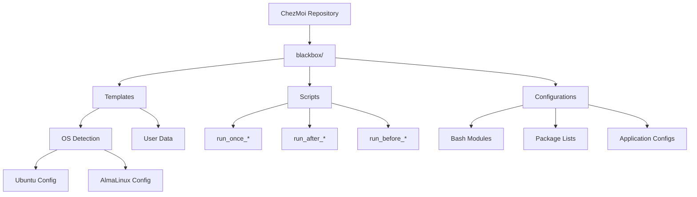
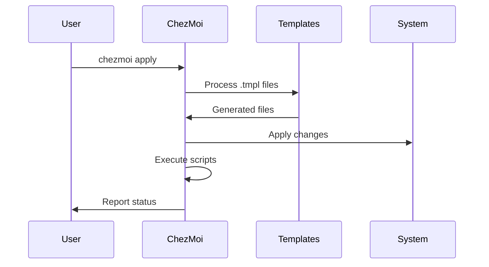

# Architecture Overview

This ChezMoi dotfiles repository follows a modular, template-driven architecture designed for maintainability and cross-platform compatibility.

## Core Principles

### 1. Template-First Design

Every configuration file can be templated using Go's template syntax, allowing for:

- OS-specific configurations
- User-specific customizations
- Environment-aware settings
- Conditional feature enablement

### 2. Modular Components

The system is broken down into discrete, optional components:

- **Bash modules**: Individual features that can be enabled/disabled
- **Libraries**: Reusable shell functions for common tasks
- **Package definitions**: Declarative package management
- **Scripts**: Automated setup and maintenance tasks

### 3. Idempotent Operations

All operations are designed to be safely repeatable:

- Scripts check for existing installations
- Configuration changes are non-destructive
- State management prevents duplicate executions

## System Architecture



## Key Components

### ChezMoi Root Structure

The repository uses `blackbox/` as the ChezMoi root (configured in `.chezmoiroot`), providing a clean separation between:

- ChezMoi-managed files (inside `blackbox/`)
- Repository metadata (root level)
- Development utilities (`common/`, `sandbox/`)

### Template Processing

Templates use Go's text/template syntax with ChezMoi-specific data:

```go
{{- if .isUbuntu }}
# Ubuntu-specific configuration
{{- else if .isAlmaLinux }}
# AlmaLinux-specific configuration
{{- end }}
```

### Script Execution Order

Scripts execute in a defined sequence:

1. **Pre-requisites** (`run_before_*`): System preparation
2. **Setup** (`run_once_setup_*`): One-time installations
3. **Main** (`run_once_*`): Core installations (numbered)
4. **Post-processing** (`run_after_*`): Final configurations

### Library System

Modular shell libraries provide reusable functionality:

- **Logger**: Structured logging with color support
- **Bitwarden**: Secret management integration
- **Gum**: Interactive UI components
- **Rage**: Age encryption wrapper
- **Skate**: Key-value storage

### Package Management Layers

1. **OS Packages**: Native package manager (apt/dnf)
2. **Homebrew**: Cross-platform developer tools
3. **Local Repositories**: Self-hosted .deb and pip packages
4. **Language-specific**: pip, cargo, go get, etc.

## Data Flow



## Security Model

- Secrets managed through Bitwarden integration
- Age/rage encryption for sensitive data
- No secrets stored in the repository
- Sudo configuration for privileged operations

## Extension Points

The architecture provides multiple extension points:

1. **New bash modules**: Add to `dot_bashrc.avail/`
2. **Custom libraries**: Create in `dot_local/lib/`
3. **Additional scripts**: Add `run_once_*.sh.tmpl` files
4. **Package lists**: Update `.chezmoidata/*.toml` files
5. **Templates**: Any file can become a `.tmpl`

This modular architecture ensures the system remains maintainable, extensible, and adaptable to different environments and requirements.